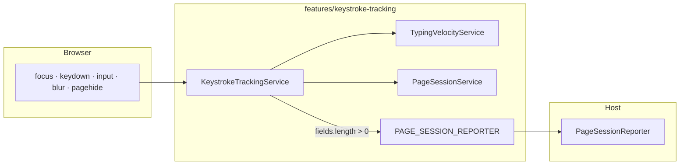

# Keystroke Velocity Tracker

A portable Angular module that measures **typing velocity and related behavioral signals** on tracked `<input>` fields, aggregates them into a **page session**, and emits a single **`PageSessionMetrics`** report when the session ends.

This repository is a **working reference implementation**: a self-contained transfer package plus a small loan-app sandbox that makes the feature observable locally.

```text
Browser events → field measurement → page aggregation → host reporter
```

---

## What it measures

### Per field (`TypingVelocityMetrics`)

Completed when a tracked field blurs or the page session ends.

| Signal | Description |
| --- | --- |
| `totalKeystrokes` | Non-repeat keydown count (includes Tab, modifiers, arrows — not just characters) |
| `averageIntervalMs` / `minIntervalMs` / `maxIntervalMs` | Gaps between consecutive keydown timestamps |
| `dominantInputType` | Most frequent `InputEvent.inputType` (`insertText`, `insertFromPaste`, etc.) |
| `msFromFocusToFirstInput` | Delay from focus to first value change |
| `hasUntrustedInput` | Any script-dispatched `input` event |
| `inputWithoutKeydown` | Value changed without preceding keystrokes (paste, autofill, programmatic fill) |

### Per page session (`PageSessionMetrics`)

Emitted once when the host calls `endPageSession()`.

| Signal | Description |
| --- | --- |
| `sessionDurationMs` | Wall time from session start to end |
| `timeToFirstInteractionMs` | First tracked focus/keydown/input after session start |
| `timeToFirstInputMs` | First text input anywhere on the page |
| `averageTimeBetweenFieldsMs` / min / max | Blur → next focus on a different field |
| `totalIdleTimeMs` | Sum of interaction gaps exceeding 2 s |
| `fields` | Batch of completed `TypingVelocityMetrics` |

**Privacy posture:** no field values, no `InputEvent.data`, no key characters — only counts, intervals, HTML/input types, timing, and trust flags.

---

## Quick start

**Requirements:** Node.js, npm

```bash
npm install
npm start
```

Open [http://localhost:4200](http://localhost:4200). Type in the login form's tracked fields, then click **Login** to flush the page session. Reported metrics appear in the sandbox panel and in the browser console.

---

## Architecture

The module separates **orchestration**, **measurement**, and **reporting** so a production host can swap only the reporting layer.



| Layer | File(s) | Responsibility |
| --- | --- | --- |
| Orchestration | `keystroke-tracking.service.ts` | Global capture-phase listeners, lifecycle API, report seam |
| Field measurement | `typing-velocity.service.ts` | Per-field keystroke intervals and input/trust signals |
| Page aggregation | `page-session.service.ts` | Session batching and page-level behavioral metrics |
| Contracts | `models/*.ts` | `TypingVelocityMetrics`, `PageSessionMetrics` |
| Integration | `page-session-reporter.ts` | `PAGE_SESSION_REPORTER` token — **no default implementation** |

Public API: import everything from `src/app/features/keystroke-tracking/index.ts`.

---

## Transfer into a production app

### Copy

```
src/app/features/keystroke-tracking/    ← entire folder, no edits required
```

Depends only on `@angular/core` and `@angular/common` (`DOCUMENT`).

### Leave behind

```
src/app/sandbox/                        ← demo reporter + metrics panel
src/app/pages/                          ← loan-app demo UI
```

Search the repo for **`SANDBOX ONLY`** to find every scaffolding touch point.

### Host responsibilities

1. **Provide a reporter** — implement `PageSessionReporter` and bind it to `PAGE_SESSION_REPORTER`:

```ts
// app.config.ts
import { PAGE_SESSION_REPORTER } from './features/keystroke-tracking';
import { EnterprisePageSessionReporter } from './analytics/enterprise-page-session.reporter';

{ provide: PAGE_SESSION_REPORTER, useClass: EnterprisePageSessionReporter }
```

2. **Initialize once** at app startup:

```ts
keystrokeTrackingService.initialize();
```

Remove the sandbox-only `startPageSession()` call inside `initialize()` — production hosts drive sessions from navigation.

3. **Drive the page-session lifecycle** on every route transition:

```ts
keystrokeTrackingService.endPageSession('navigation');
keystrokeTrackingService.startPageSession(nextPageId);
```

See `src/app/app.ts` → `onHostNavigation()` for the framework-agnostic pattern. The module never imports a router.

---

## Repository layout

```text
src/app/features/keystroke-tracking/   Transfer package (copy as-is)
src/app/sandbox/                     Demo reporter + JSON metrics panel
src/app/pages/                       Loan-app demo (login, dashboard)
docs/keystroke-tracking-guide.md     Technical reference (start here)
docs/typing-velocity.md             Architecture rationale + known issues
docs/test-results.md                 Sample human vs. scripted session output
cypress/e2e/typing-velocity-*.cy.ts  E2E validation (sandbox-coupled)
```

---

## Documentation

| Doc | Use when you need… |
| --- | --- |
| [`docs/keystroke-tracking-guide.md`](docs/keystroke-tracking-guide.md) | Runtime flow, data models, change map, testing — **primary reference** |
| [`docs/typing-velocity.md`](docs/typing-velocity.md) | Design rationale, separation of concerns, transfer checklist, open issues |
| [`docs/test-results.md`](docs/test-results.md) | Recorded metric samples from human and scripted sessions |

When docs and code disagree, **code is source of truth**.

---

## Development

| Command | Purpose |
| --- | --- |
| `npm start` | Dev server at `http://localhost:4200` |
| `npm run build` | Production build → `dist/` |
| `npm test` | Unit tests (Vitest) |
| `npm run cypress:open` | Interactive E2E runner |
| `npm run cypress:run` | Headless E2E (`typing-velocity-human`, `typing-velocity-robot`) |

Built with [Angular CLI](https://angular.dev/tools/cli) 21.
