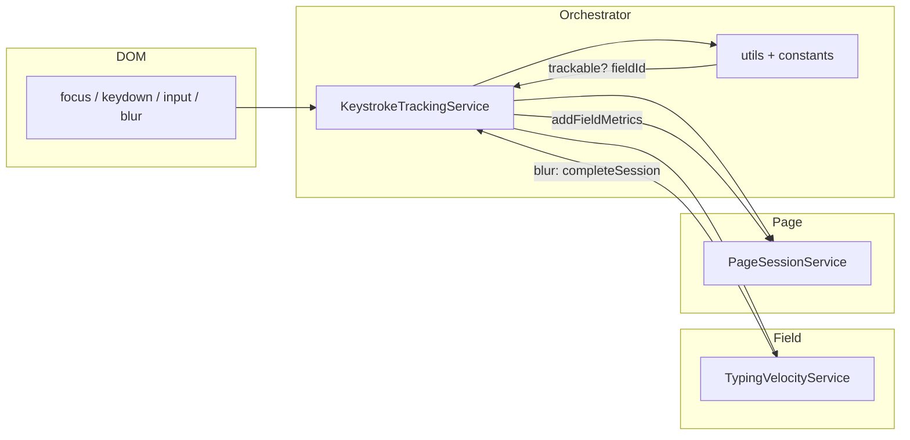
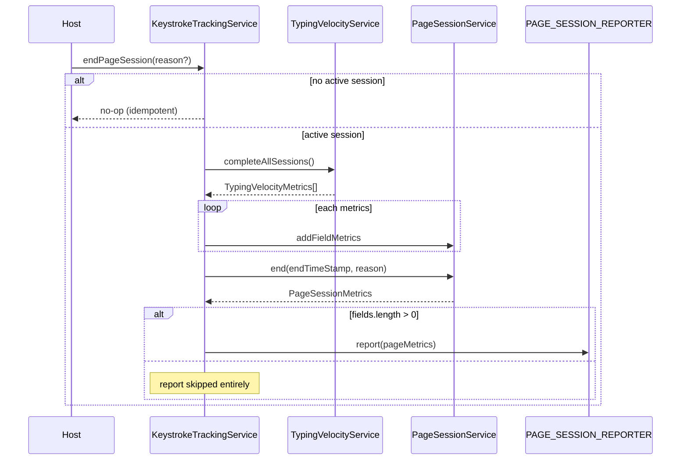
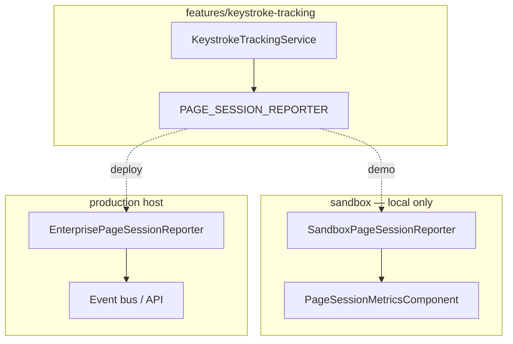
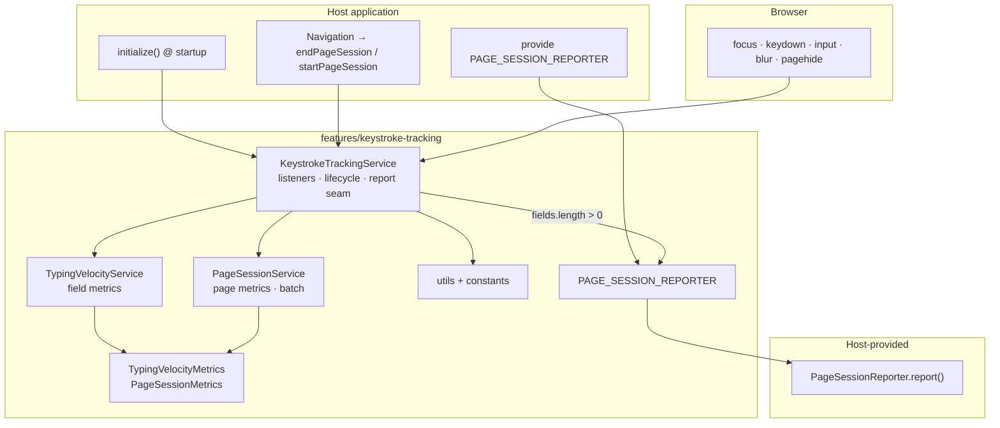

# Keystroke Tracking — Technical Guide

Standalone reference for `src/app/features/keystroke-tracking/`. Complements [typing-velocity.md](./typing-velocity.md) (architecture rationale and transfer checklist). **Code is source of truth** when this doc and implementation diverge.

---

## 1. What the feature does

| Aspect | Behavior |
| --- | --- |
| **Goal** | Measure typing velocity and related behavioral signals on **tracked `<input>` fields**, aggregate per **page session**, emit one **`PageSessionMetrics`** report when the session ends. |
| **Granularity** | **Field session** (implicit: focus → blur or page end) + **page session** (explicit: host-driven `startPageSession` / `endPageSession`). |
| **Reporting** | **No per-field reports.** Completed fields are collected; a single batch goes to the host via **`PAGE_SESSION_REPORTER`**. |
| **Privacy posture** | No field values, no `InputEvent.data`, no key characters — only counts, intervals, HTML/input types, timing, trust flags. |
| **Dependencies** | `@angular/core`, `@angular/common` (`DOCUMENT`) only inside the transfer package. No router, no UI, no console in the module (one dev `console.warn` on invalid lifecycle). |

**Out of scope (by design):** scoring/fraud decisions, enterprise event schemas, which routes count as “pages” — all host concerns.

---

## 2. Package layout

```
src/app/features/keystroke-tracking/     ← TRANSFER PACKAGE (copy as-is)
├── index.ts                             Public exports only
├── keystroke-tracking.service.ts        DOM listeners + lifecycle + report seam
├── typing-velocity.service.ts           Per-field measurement
├── page-session.service.ts              Page session + page-level metrics
├── keystroke-tracking-utils.ts          Trackable input + field id
├── keystroke-tracking.constants.ts      Tracked input types policy
├── page-session-reporter.ts             PAGE_SESSION_REPORTER token + interface
└── models/
    ├── typing-velocity.model.ts         TypingVelocityMetrics
    └── page-session.model.ts            PageSessionMetrics

src/app/sandbox/                           ← DO NOT TRANSFER
├── sandbox-page-session.reporter.ts     Demo PageSessionReporter
└── page-session-metrics/                JSON panel (reads reporter only)

Host wiring examples (demo app, not part of feature):
  app.config.ts  → provide PAGE_SESSION_REPORTER
  app.ts         → initialize(); onHostNavigation() example seam
  login/dashboard → SANDBOX ONLY lifecycle + metrics panel
```

Search **`SANDBOX ONLY`** in the repo for every demo touch point.

---

## 3. End-to-end runtime flow

### 3.1 Startup

```mermaid
sequenceDiagram
  participant Host as Host (App)
  participant KTS as KeystrokeTrackingService
  participant DOC as document / window
  participant PSS as PageSessionService

  Host->>KTS: initialize() once
  KTS->>DOC: addEventListener focus/keydown/input/blur (capture)
  KTS->>DOC: addEventListener pagehide (fallback)
  Note over KTS: SANDBOX: startPageSession() inside initialize()
  Note over Host: Production: remove sandbox start; drive from navigation
  KTS->>PSS: start(performance.now(), pageId?)
```

### 3.2 During an active page session (collect only)



| Event | TypingVelocityService | PageSessionService |
| --- | --- | --- |
| **focus** | `trackFocus` | `recordInteraction`, `recordFieldFocus` |
| **keydown** | `trackKeydown` (skips `repeat`) | `recordInteraction` |
| **input** | `trackInput` (type, trusted, timestamps) | `recordInteraction`, `recordInput` |
| **blur** | `completeSession` → metrics or null | `addFieldMetrics` if non-null; `recordFieldCompletion` |

Events outside tracked inputs are ignored. Listeners use **capture phase** so tracking still runs if components stop propagation on bubble.

### 3.3 Page session end (single report)



**Fallback:** `pagehide` → `endPageSession('pagehide')`. Safe when host already ended session (idempotent end).

---

## 4. Architecture — responsibilities

| Component | Owns | Does not |
| --- | --- | --- |
| **`KeystrokeTrackingService`** | Global listeners; filter + delegate; `initialize`, `startPageSession`, `endPageSession`; `reportPageSession` → reporter | Field math; page metric formulas; logging/UI; default reporter |
| **`TypingVelocityService`** | Per-`fieldId` state; keystroke intervals; input/trust accumulators; `TypingVelocityMetrics` on complete | DOM; page session; reporting |
| **`PageSessionService`** | Session active flag; field batch; page-level timing from primitive signals; `PageSessionMetrics` on `end` | Per-field velocity; DOM |
| **`keystroke-tracking-utils`** | `isKeystrokeTrackableInputElement`, `getKeystrokeTrackedFieldId` | State |
| **`keystroke-tracking.constants`** | `KEYSTROKE_TRACKED_INPUT_TYPES` | Logic |
| **`page-session-reporter.ts`** | `PageSessionReporter`, `PAGE_SESSION_REPORTER` token | Implementation |
| **Models** | Type contracts for emit shape | Behavior |

### Separation rationale (one line each)

- **Orchestrator vs measurement:** swap math or reporting without rewiring listeners.
- **Field vs page services:** different lifecycles and change rates.
- **Reporter injection:** production destination is one host-provided class.

---

## 5. Data models

### 5.1 `TypingVelocityMetrics` (per completed field)

| Field | Meaning |
| --- | --- |
| `fieldId` | `element.name \|\| element.id` |
| `totalKeystrokes` | Count of non-`repeat` keydowns (see §9 — includes non-character keys) |
| `averageIntervalMs` / `minIntervalMs` / `maxIntervalMs` | Gaps between consecutive keydown timestamps (non-negative only) |
| `inputType` | HTML `input.type` (e.g. `password`, `email`) |
| `dominantInputType` | Most frequent `InputEvent.inputType` (e.g. `insertText`, `insertFromPaste`) |
| `msFromFocusToFirstInput` | First `input` timestamp − focus timestamp; `null` if missing or negative span |
| `hasUntrustedInput` | Any `input` with `isTrusted === false` |
| `inputWithoutKeydown` | Value changed via `input` while `totalKeystrokes === 0` at that moment |

**Empty field sessions** (focus only, no keydown/input/untrusted) → `completeSession` returns **`null`** → not added to page batch.

### 5.2 `PageSessionMetrics` (one report per page session)

| Field | Calculation (anchor: `startTimeStamp` from `startPageSession`) |
| --- | --- |
| `sessionDurationMs` | `endTimeStamp − startTimeStamp` (`performance.now()` at end) |
| `timeToFirstInteractionMs` | First tracked focus/keydown/input − start; once; `null` if none |
| `timeToFirstInputMs` | First `input` anywhere − start; once; `null` if none |
| `averageTimeBetweenFieldsMs` | `transitionSum / transitionCount`; `null` if no transitions |
| `minTimeBetweenFieldsMs` / `maxTimeBetweenFieldsMs` | Min/max blur→next-focus on **different** `fieldId` |
| `totalIdleTimeMs` | Sum of gaps between consecutive interactions **>** `IDLE_THRESHOLD_MS` (2000 ms); trailing idle to session end **not** counted |
| `fields` | Array of `TypingVelocityMetrics` collected during session |

**Timestamps:** Normally `performance.now()` (session bounds) and `event.timeStamp` (interactions) share a timeline; spans use `nonNegativeSpan` (negative → `null`).

**Not emitted (stored only):** `pageId`, `endReason` on `PageSessionService` — API placeholders for future reporting context.

---

## 6. Field & page lifecycle rules

### Field session

- Starts on first tracked **focus / keydown / input** for that `fieldId`.
- Ends on **blur** (`completeSession`) or **page end** (`completeAllSessions`).
- Map entry deleted on complete; new activity after blur starts fresh state.

### Page session

| Rule | Behavior |
| --- | --- |
| **Who defines “page”** | Host only — via lifecycle methods |
| **No overlap** | Second `startPageSession` while active → ignored + `console.warn` |
| **Idempotent end** | `endPageSession` with no session → no-op |
| **Zero-field pages** | If `fields.length === 0` after end → **no** `report()` (page-level metrics dropped too) |
| **Metadata** | `pageId` / `reason` stored, not in `PageSessionMetrics` yet |

---

## 7. Sandbox vs production

| Topic | Sandbox (this repo) | Production host |
| --- | --- | --- |
| **First session** | `initialize()` calls `startPageSession()` | Remove that call; start on first route enter |
| **Navigation boundaries** | Login/Logout buttons call `endPageSession('navigation')` then `startPageSession()` | Router (e.g. `NavigationEnd`): same pair; see `App.onHostNavigation()` |
| **Reporter** | `SandboxPageSessionReporter` → `console.log` + signal history | Enterprise `PageSessionReporter` |
| **DI** | `app.config.ts`: `{ provide: PAGE_SESSION_REPORTER, useExisting: SandboxPageSessionReporter }` | Replace `useExisting` / `useClass` with production reporter |
| **Observability** | `PageSessionMetricsComponent` reads **reporter**, not tracking services | Your analytics pipeline |
| **Example seam** | `app.ts` `onHostNavigation()` — documented, **not wired** to router in sandbox | Wire to your navigation system |



---

## 8. `PAGE_SESSION_REPORTER` boundary

**Contract**

```ts
interface PageSessionReporter {
  report(metrics: PageSessionMetrics): void;
}
```

| Property | Detail |
| --- | --- |
| **Single call site** | `KeystrokeTrackingService.reportPageSession()` → `this.reporter.report(metrics)` |
| **No default provider** | Missing token → DI failure at startup (intentional — avoids silent data loss) |
| **Host work** | Map `PageSessionMetrics` to enterprise events, correlation IDs, sampling, PII policy |
| **Module must not** | Import analytics SDKs, know event names, or hold “last reported” UI state |

**Sandbox reference:** `src/app/sandbox/sandbox-page-session.reporter.ts` — append-only signal list + console.

---

## 9. Change map — where to edit

| If you want to… | Touch |
| --- | --- |
| Add/remove tracked HTML input types | `keystroke-tracking.constants.ts` |
| Change trackability rules (e.g. require `id`, add `<textarea>`) | `keystroke-tracking-utils.ts` (+ constants if new types) |
| Change which keys count as keystrokes | `KeystrokeTrackingService.onKeydown` and/or `TypingVelocityService.trackKeydown` |
| Add new **field-level** metrics | `TypingVelocityService` state + `buildFieldMetrics`; extend `TypingVelocityMetrics` |
| Add new **page-level** metrics | Feed new signals from orchestrator → `PageSessionService`; extend `PageSessionMetrics` |
| Change idle definition | `IDLE_THRESHOLD_MS` in `page-session.service.ts` |
| Change when reports fire (e.g. empty pages) | `KeystrokeTrackingService.endPageSession` gate on `fields.length` |
| Wire production analytics | New class implementing `PageSessionReporter` + `app.config` provider only |
| Drive sessions from routes | Host: remove sandbox `startPageSession` in `initialize()`; subscribe navigation → `end` then `start` |
| Reuse rules in existing behavior tracker | Import `isKeystrokeTrackableInputElement`, `getKeystrokeTrackedFieldId`, `KEYSTROKE_TRACKED_INPUT_TYPES` from `index.ts` — do not duplicate |
| Expose new public API | Export from `index.ts` only |
| Demo UI / JSON panel | `src/app/sandbox/` only — never in feature folder |

**Do not** add reporting side effects inside `TypingVelocityService` or `PageSessionService`.

---

## 10. Production transfer checklist

### Copy

- Entire folder: `src/app/features/keystroke-tracking/`

### Leave behind

- `src/app/sandbox/**`
- Demo pages/services; SANDBOX ONLY blocks in login/dashboard/`keystroke-tracking.service.ts` `initialize()`

### Host must implement

1. **`PageSessionReporter`** + `{ provide: PAGE_SESSION_REPORTER, … }`
2. **`KeystrokeTrackingService.initialize()`** once at bootstrap (without sandbox auto-`startPageSession` unless you intentionally mirror demo)
3. **Navigation:** on every page/route change: `endPageSession(...)` then `startPageSession(pageId?)`
4. **Tests:** provide a reporter stub (see `app.spec.ts`)

### Keep as-is in production

- Capture-phase listeners, `pagehide` fallback, three services + models
- Public lifecycle API on `KeystrokeTrackingService`

### If host already has document listeners

- Reuse exported utils/constants from `index.ts` so “tracked field” definitions stay single-sourced.

---

## 11. Known limitations & open issues

Documented in [typing-velocity.md § Known Issues](./typing-velocity.md#known-issues-and-open-items); summary:

| # | Issue | Impact |
| --- | --- | --- |
| 1 | **Cross-realm / synthetic `timeStamp`** — no upper bound on focus→first-input | Instant scripted fills can show ** huge** `msFromFocusToFirstInput` (see [test-results.md](./test-results.md)); fraud signal can invert |
| 2 | **`totalKeystrokes` includes Tab, modifiers, arrows, Backspace** | Not “characters typed”; tab navigation adds phantom keystrokes |
| 3 | **Password fields tracked** + keystroke count | Residual length inference; policy decision needed |
| 4 | **`fieldId` = name \|\| id**, page-wide | Duplicate names merge buckets; missing name/id → **untracked** |
| 5 | **Zero-field page sessions not reported** | Page-open-with-no-typing emits nothing |
| 6 | **`pageId` / `endReason` write-only** | Not on `PageSessionMetrics` yet |

**Not defects:** bounded field map, no `InputEvent.data`, minimal per-event work, listeners live for app lifetime (no teardown unless host remounts app).

**Dev-only noise:** `console.warn` on overlapping `startPageSession` — consider `isDevMode()` in production.

---

## 12. Testing & validation

### Current automated coverage

| Layer | Coverage |
| --- | --- |
| **`TypingVelocityService`** | None (unit) |
| **`PageSessionService`** | None (unit) |
| **`KeystrokeTrackingService`** | Smoke via `app.spec.ts` (reporter required) |
| **E2E** | Cypress `typing-velocity-human.cy.ts`, `typing-velocity-robot.cy.ts` |

**Cypress coupling (does not transfer):**

- Reads latest session from `.metrics-list details pre` (`cypress/support/commands.ts`)
- Depends on sandbox panel + Login flush (`flushPageSessionViaLogin`)
- Asserts human vs bot profiles (interval variance, `insertFromPaste`, `inputWithoutKeydown`, field transition times)

**Highest-value addition for receiving team:** direct unit tests on `TypingVelocityService` and `PageSessionService` (pure inputs/outputs, no DOM, no `TestBed` required for service logic).

### Manual / local validation (sandbox)

1. Run app; open login page with metrics panel.
2. Type in tracked fields; blur or navigate (Login) to end session.
3. Confirm new JSON block in panel matches console `Page session metrics`.
4. Compare human typing vs paste simulation (helpers in `cypress/support/typing-velocity-helpers.ts`).

---

## 13. Quick-reference architecture diagram



---

## 14. Public API (`index.ts`)

| Export | Use |
| --- | --- |
| `KeystrokeTrackingService` | Bootstrap + lifecycle |
| `TypingVelocityService`, `PageSessionService` | Optional direct test / custom plumbing |
| `PAGE_SESSION_REPORTER`, `PageSessionReporter` | Host integration |
| `TypingVelocityMetrics`, `PageSessionMetrics` | Typing in reporter / mappers |
| `isKeystrokeTrackableInputElement`, `getKeystrokeTrackedFieldId`, `KEYSTROKE_TRACKED_INPUT_TYPES` | Shared tracking rules with other host listeners |

---

## Related docs

- [typing-velocity.md](./typing-velocity.md) — deep architecture narrative, event flow prose, transfer notes
- [test-results.md](./test-results.md) — Cypress output samples (cross-realm timing example)
